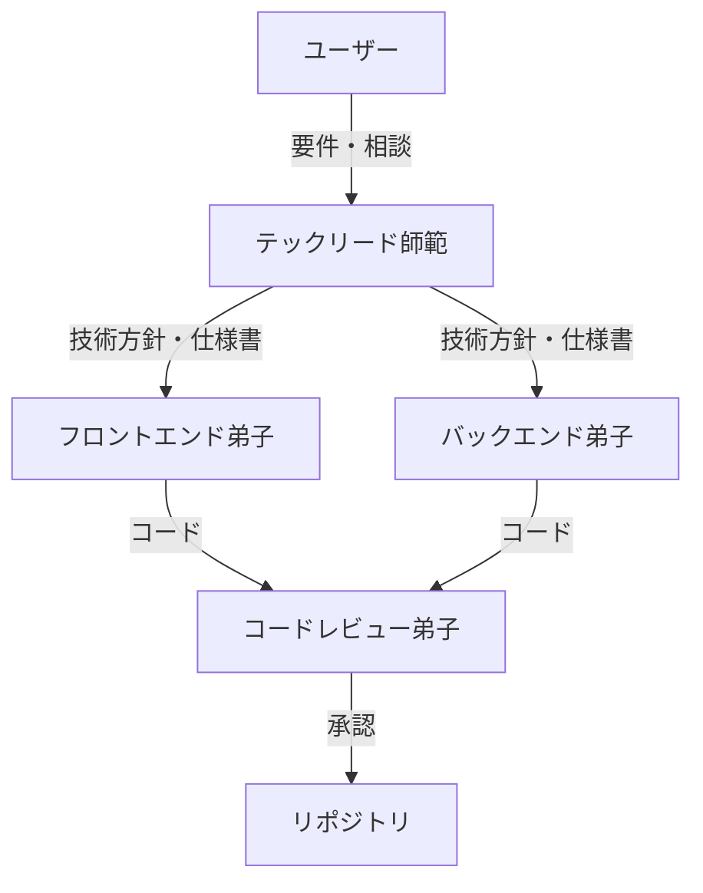
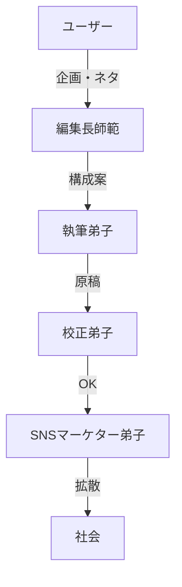

# 道場全体設計図 (Grand Design)

## 思想：段階的開示 (Progressive Disclosure)
複雑なタスクを解決する際、最初から全てのエージェントを呼び出すのではなく、**「司令塔（師範）」から「専門家（弟子）」へ**とコンテキストを引き継ぎながら詳細化していくアーキテクチャを採用する。

## エージェント連携フロー

### 1. 開発フロー

### 2. 広報フロー

## ディレクトリ構造の意図
- **shihan/**: 変更頻度が低く、高い信頼性が求められるコア定義。
- **deshi/**: プロジェクトごとにカスタマイズされたり、頻繁にアップデートされる実験的な定義。
- **menkyo-kaiden/**: これら自然言語の定義を、Gemini CLIやCursorなどのツール設定ファイル（JSON/YAML等）に変換した結果。
