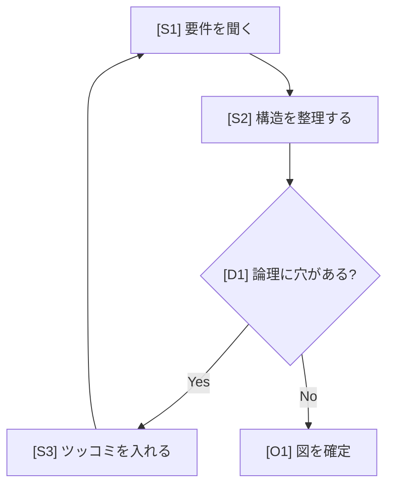
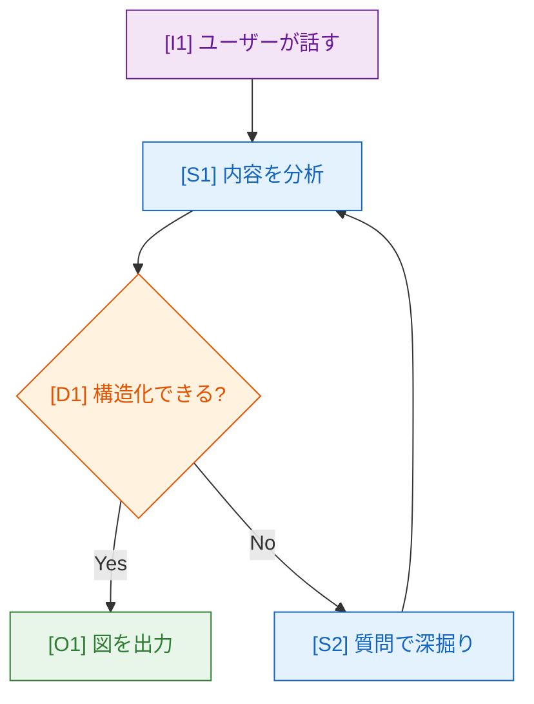

# action-gen-mermaid-skill — 図で考えるスキル

- Purpose: 会話の内容をMermaid図に構造化し、図の構造を磨くことで論理を磨く体験を提供する
- Scope: 思考の可視化、構造分析、Mermaid図生成、差分更新

会話の内容をMermaid図に構造化し、図の構造を磨くことで論理を磨く体験を提供する。

## 核となる思想

図は「成果物」ではなく「思考のツール」。

```text
話す → 図にする → 構造のツッコミで気づく → 話し直す → 図が更新される
```

このループを高速に回すことが目的。

---

## ワークフロー

### Step 1: 会話の分析と図の種類の選択

会話の内容と思考の成熟度に応じて図の種類を選ぶ。

| 思考のフェーズ | 推奨する図 | 用途 |
| ------------- | ---------- | ------ |
| 発散・ブレスト初期 | `mindmap` | アイデアの全体像を掴む |
| 整理・分類 | `flowchart TD` | 関係性と流れを明確化 |
| 手順・プロセス | `flowchart TD` | ステップと分岐を可視化 |
| やり取り・連携 | `sequenceDiagram` | 誰が何をいつやるか |
| 状態・ライフサイクル | `stateDiagram-v2` | 状態と遷移条件 |
| データ構造・関係性 | `erDiagram` | エンティティ間の関係 |

思考が深まるにつれて図の種類を「昇格」させる:

- ブレスト段階 → **マインドマップ** で全体を広げる
- 構造が見えてきたら → **フローチャート** で論理を固める
- 詳細化するなら → **シーケンス図** や **状態遷移図** で精密に

ユーザーが図の種類を指定した場合はそれに従う。

### Step 2: ノードIDラベル付きのMermaidコード生成

**全ノードに参照用ラベルをつける。** これにより、ユーザーが「B2のところがおかしい」と
ピンポイントで指摘できるようになる。

#### ラベルルール

```text
カテゴリ文字 + 連番
```

- フローチャートの場合: ノードの役割で分類
  - `S1, S2...` = ステップ（通常のノード）
  - `D1, D2...` = 判断・分岐（ひし形ノード）
  - `I1, I2...` = 入力・トリガー
  - `O1, O2...` = 出力・結果
- マインドマップの場合: 階層で分類
  - `R` = ルート
  - `A1, A2...` = 第1階層
  - `A1a, A1b...` = 第2階層（親のIDを継承）
- シーケンス図の場合: アクターに自然な短縮名を使う

#### 表示フォーマット

ノードのラベルにIDを含めて表示する:



こうすることで、図の中にIDが視覚的に表示され、会話中に「D1の分岐条件が曖昧だ」と言える。

### Step 3: レンダリング

スキルの `scripts/render.sh` を使う。出力先は固定ディレクトリ。

```bash
# 初回: SVG生成 + ビューア起動
bash <SKILL_DIR>/scripts/render.sh /home/claude/mermaid-diagram.mmd /home/claude/mermaid-out --open

# 2回目以降: SVG生成のみ（ブラウザ側でリロードすれば最新が見える）
bash <SKILL_DIR>/scripts/render.sh /home/claude/mermaid-diagram.mmd /home/claude/mermaid-out
```

`<SKILL_DIR>` は、このSKILL.mdが存在するディレクトリのパス。

**仕組み:**

- render.shは毎回 **SVGをHTML内に埋め込んだ自己完結型viewer.html** を生成する
- viewer.htmlは単体で動作する。外部ファイル依存なし
- `--open` は初回のみつける。ブラウザでビューアが開く
- 2回目以降はrender.sh実行後、ブラウザをリロードすれば最新の図が表示される
- `present_files` でviewer.htmlを共有すれば、claude.aiのアーティファクト上でも表示できる

SVG出力を使う理由:

- 軽量（PNGの100分の1以下）
- ズームしても鮮明
- mmdc一発で生成可能

### Step 4: 構造のツッコミ（最重要）

図を出力したら、**必ず構造に対するフィードバックを添える。**

ツッコミの観点:

| 観点 | 例 |
| ----- | ----- |
| **曖昧な関係** | 「S2→S3 の矢印は何の条件で進むのか不明確です」 |
| **抜けている分岐** | 「D1でNoの場合のパスが考慮されていません」 |
| **粒度の不揃い** | 「S1は大きすぎます。分解できそうです」 |
| **孤立ノード** | 「O2が他のどこにも繋がっていません」 |
| **循環の妥当性** | 「S3→S1のループに終了条件がありません」 |
| **抽象度のズレ** | 「A2aだけ具体的すぎて他と粒度が合いません」 |

**フォーマット:**

```text
📐 構造チェック:
- D1: 「論理に穴がある?」の判断基準が曖昧。何を持って"穴"とする?
- S3→S1 のループ: 何回繰り返す想定? 終了条件は?
- O1 に至るパスが1つしかない。本当にそれだけ?
```

ノードIDで指摘することで、ユーザーが「確かにD1は〜にしよう」と返しやすくなる。

### Step 5: 差分の提示（更新時）

2回目以降の図を出すときは、**前回との差分を必ず示す。**

```text
🔄 前回からの変更:
- [追加] D2: 新しい分岐「予算内か?」を追加
- [変更] S3: 「確認する」→「レビュー会議を開く」に具体化
- [削除] S5: 「報告書を書く」はO1に統合
- [構造] S2→D1 の間にS2aを挿入して段階を細分化
```

これにより思考の進化が目に見える。

### Step 6: ファイル共有

```bash
cp /home/claude/mermaid-out/viewer.html /mnt/user-data/outputs/mermaid-viewer.html
```

`present_files` ツールで `/mnt/user-data/outputs/mermaid-viewer.html` を共有する。
viewer.htmlはSVG埋め込み済みの自己完結ファイルなので、アーティファクトとしてそのまま表示される。

---

## 出力ファイル（固定パス、上書き更新）

```text
/home/claude/mermaid-diagram.mmd              ← Mermaidソース（最新版）
/home/claude/mermaid-out/mermaid-diagram.svg   ← 描画結果SVG
/home/claude/mermaid-out/viewer.html           ← 自己完結HTMLビューア（SVG埋め込み済み）
```

render.shを実行するたびにSVGとviewer.htmlの両方が更新される。

同じパスを常に使い、更新のたびに上書きする。

---

## 会話の進め方のガイド

### 初回

1. 会話の内容から図を生成
2. ノードID付きで描画
3. 構造のツッコミを添える
4. 「どう思いますか? 気になるノードがあればIDで教えてください」と促す

### 2回目以降

1. ユーザーのフィードバック（「D1を〜に変えて」「S3は要らない」等）を反映
2. 差分を提示
3. 新たなツッコミを添える
4. ループを続ける

### 昇格の提案

議論が深まったら図の種類の変更を提案する:

- 「マインドマップで全体像が見えてきたので、フローチャートに昇格して流れを固めませんか?」
- 「フローチャートが複雑になってきたので、フェーズごとに分割しましょうか?」

---

## Mermaidコードのスタイルガイド

- **ノードIDは英数字**: `S1["[S1] 日本語ラベル"]`
- **ラベルの先頭にID表記**: `[S1]` のように角括弧で囲む
- **色分け**: 役割ごとに `classDef` を使う



---

## エラーハンドリング

- `mmdc` 失敗 → Mermaid構文を修正して再試行
- 図が大きすぎ → 情報を要約して簡略化、または分割を提案
